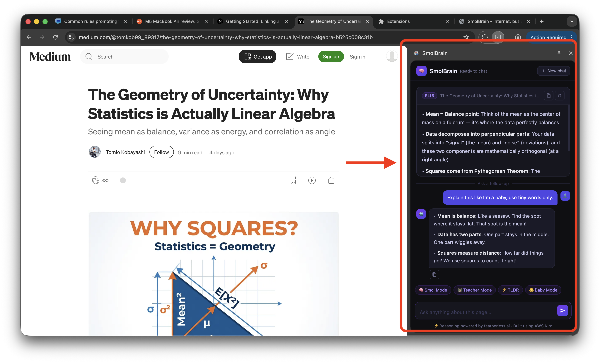
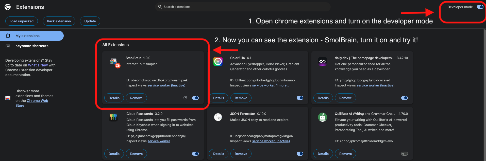

# SmolBrain  🧠✨
### Internet, but Simpler!

How many of you have opened a webpage and thought — why is this written so complicated?

---

## ⚠️ The Problem

The Internet is unnecessarily complex.

- 📘 Technical documentation  
  API references and developer guides written for experts  

- 📄 Research papers  
  Academic studies packed with jargon and methodology  

- ⚖️ Legal policies  
  Terms and conditions that require a law degree  

- 🏥 Medical information  
  Health articles full of technical terminology  

- 📝 Complex blogs  
  Long-form content that assumes too much background knowledge 

**The problem isn't the idea — it's the language.  
Brilliant concepts get lost in unnecessarily complex writing.**

---

## 🚀 SmolBrain — Internet, but Simpler!

One click. Any page. Instantly simpler.

- Chrome Extension — it lives in your browser  
- Opens a side panel on any webpage  
- Lets users chat with the webpage  
- Multiple explanation modes  

---

## 🧠 Understanding the web your way

### 🔹 Smol Mode
Explain the page in simple terms

### 👨‍🏫 Teacher Mode
Step-by-step explanation

### ⚡ TLDR Mode
Three-bullet summary for quick understanding

### 👶 Baby Mode
Explain like you're five — no jargon, just clarity

---

## 👥 Built for everyone

- 🎓 Students  
  Reading research papers and academic materials  

- 💻 Developers  
  Navigating complex technical documentation  

- 👔 Professionals  
  Understanding legal policies and contracts  

- 🩺 Patients  
  Reading medical information and health resources  

- 🌍 Everyone  
  Non-native English speakers learning online  

---

## 🤖 Built with AI

## Structure
### Chrome extension in [chrome_extension](./chrome-extension/)

It uses the side panel api from chrome to show the initial explanation and then you can chat with the webpage directly too!

### Technology Stack

- Chrome Extension (Manifest V3)
- JavaScript
- Side Panel UI framework
- AWS Kiro — Coding platform
- Featherless.ai — inference platform
- GLM-5 AI model

### 🤝 Partners

- Featherless.ai — powering our AI inference  
- AWS Kiro — our vibe coding partner  

---

## 🎬 Demo

---

## 📄 Presentation

[Download the PDF](docs/SmolBrain.pdf)

---

## 🙌 Thank you - Powered by [featherless](https://featherless.ai/) & [AWS Kiro](https://kiro.dev/)